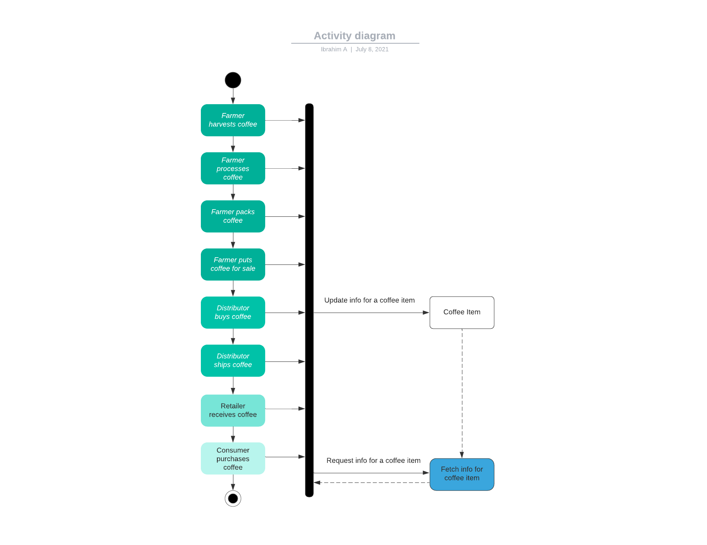
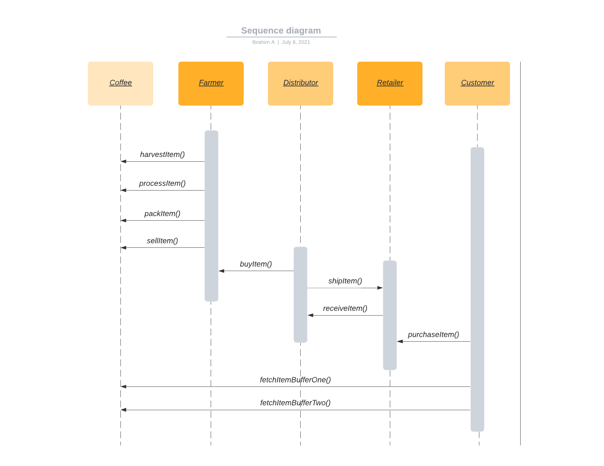
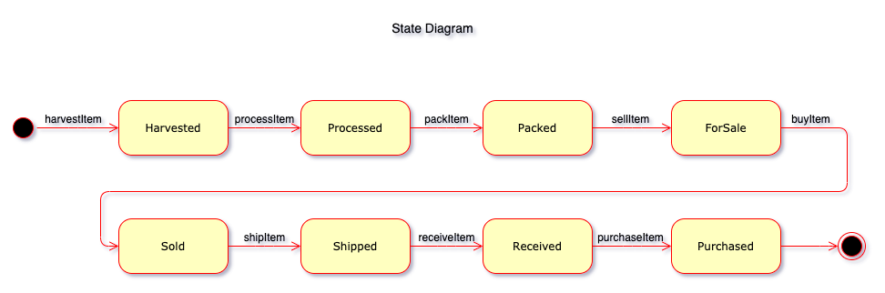
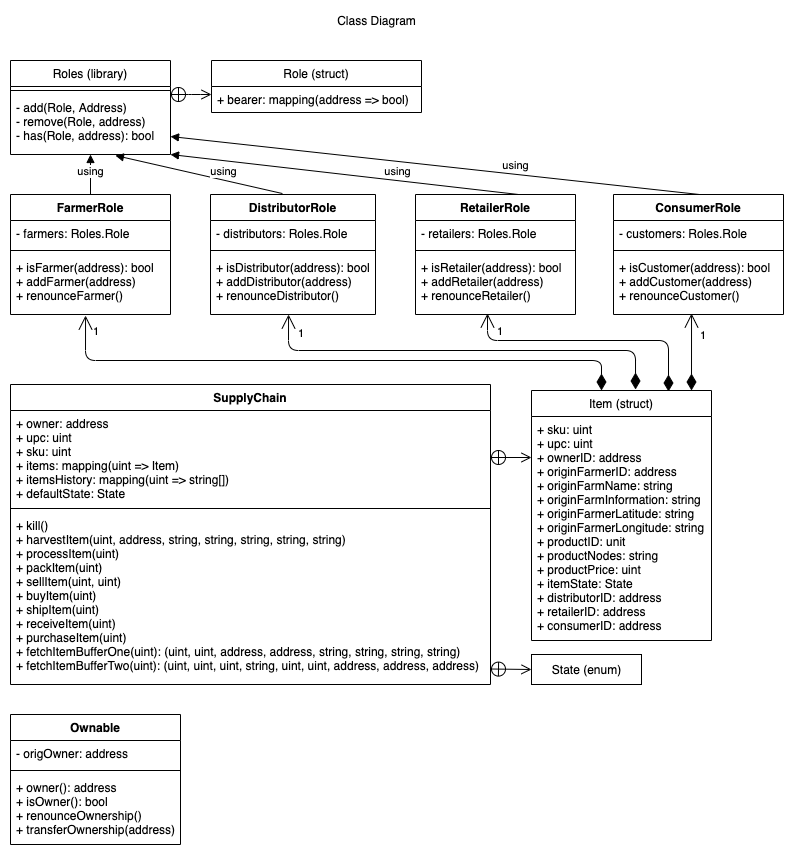

# Project #3 (Supply Chain) for the Udacity Blockchain Nanodegree

## By: Ibrahim Almohandes; July 10, 2021.

For details about the project description and requirements, see [README.md](./README.md).

### SupplyChain contract address on the Rinkeby network:

[0xfd4b279ee46f12a667db24597dd179362ab12fe3](https://rinkeby.etherscan.io/address/0xfd4b279ee46f12a667db24597dd179362ab12fe3)

### Libraries used:

* [web3.js 1.4.0](https://cdn.jsdelivr.net/gh/ethereum/web3.js@1.4.0/dist/web3.min.js) - web3 JavaScript implementation.
* [@truffle/contract 4.3.23](https://cdn.jsdelivr.net/npm/@truffle/contract@4.3.23/dist/truffle-contract.js) - truffle-contract JavaScript implementation.
* "truffle-hdwallet-provider": "^1.0.17" - required for contract deployment into the rinkeby network.

### Program revisions:

* Ganache CLI v6.12.2 (ganache-core: 2.13.2)
* Truffle v5.3.14 (core: 5.3.14)
* Solidity v0.5.16 (solc-js)
* Node v10.16.3
* Web3.js v1.4.0

### Project files:

Located under the [project-6](./project-6) folder.

### UML diagrams

